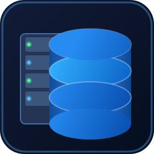

# MiniDB

<p align="center"></p>

MiniDB — учебное ядро реляционной СУБД на C++17 с настоящим постраничным движком хранения,
буферным пулом с LRU-вытеснением, B+ деревом, простым SQL-парсером, планировщиком/исполнителем
запросов, менеджером транзакций с блокировками и Undo-журналом, а также Write-Ahead логированием.

Консольный интерфейс (REPL) оформлен цветами ANSI и таблицами из псевдографики; на Windows
`minidb.exe` собирается со своей иконкой (`assets/minidb.ico` — стилизованный сервер с базой данных).

> **Просто хотите пользоваться программой (не собирать из исходников)?**
> Смотрите **[USER_GUIDE.md](USER_GUIDE.md)** — там подробно объяснено, как
> работать с SQL-командами, как перенести базу данных на флешку, как
> отформатировать флешку под MiniDB и как прочитать файлы `minidb.db`/`minidb.wal`.

## Архитектура

```
SQLLexer → SQLParser → AST → QueryPlanner → QueryExecutor
                                                  │
                                                  ▼
                                       TableHeap / BPlusTree
                                                  │
                                                  ▼
                                       BufferPoolManager (LRU)
                                          │              │
                                          ▼              ▼
                                    DiskManager      WALManager
                                          │
                                          ▼
                                     minidb.db
```

* **DiskManager** — единственный компонент, читающий/пишущий страницы по 4KB напрямую на диск.
* **BufferPoolManager** — кэширует страницы в RAM, вытесняет "холодные" страницы по алгоритму LRU,
  сбрасывая "грязные" страницы на диск.
* **BPlusTree / TableHeap** — структуры хранения, работающие исключительно через буферный пул
  (никогда не обращаются к DiskManager напрямую).
* **SQLLexer / SQLParser** — превращают текст SQL в AST (поддерживаются `CREATE TABLE`,
  `INSERT INTO ... VALUES`, `SELECT ... FROM ... [WHERE]`).
* **QueryPlanner** — строит физический план, выбирая `IndexScan` (через B+ дерево) вместо
  полного перебора `SeqScan`, когда это возможно.
* **TransactionManager / LockManager / UndoLog** — обеспечивают ACID: блокировки на уровне
  таблицы (Shared/Exclusive) и откат через журнал компенсирующих действий.
* **WALManager / Checkpoint** — журналирование "вперёд записи" (Write-Ahead Logging) для
  восстановления после сбоев.
* **ConsoleUI** — оформление REPL: цветной баннер, подсветка вывода и таблицы для результатов
  `SELECT`, отрисованные символами псевдографики (┌─┬─┐).

## Структура проекта

```
MiniDB/
├── src/
│   ├── main.cpp
│   ├── core/               # DatabaseEngine, BufferPoolManager, DiskManager, LRUReplacer
│   ├── storage/             # BPlusTree, Page, Tuple, TableHeap, Record
│   ├── query/                # SQLLexer, SQLParser, ASTNodes, QueryPlanner, QueryExecutor
│   ├── transaction/          # TransactionManager, LockManager, UndoLog
│   ├── recovery/             # WALManager, Checkpoint
│   ├── utils/                 # Logger, ErrorCodes, MemoryPool, ConsoleUI
│   ├── resources.rc           # Иконка и версия minidb.exe (только Windows)
│   └── resource.h
├── assets/                     # minidb.ico, превью иконки
├── include/                   # types.h, config.h, macros.h
├── tests/                      # test_bplus_tree, test_sql_parser, test_transactions
├── CMakeLists.txt
├── build.bat
└── README.md
```

## Установка и сборка

### Требования

- Компилятор с поддержкой C++17: GCC ≥ 9, Clang ≥ 10 или MSVC ≥ 2019.
- CMake ≥ 3.15.
- Потоки POSIX (pthreads) — на Linux/macOS обычно уже есть в системе.
- Git (для клонирования репозитория).

### 1. Получение исходного кода

```bash
git clone <URL_РЕПОЗИТОРИЯ>
cd MiniDB
```

### 2. Установка зависимостей

**Ubuntu / Debian:**

```bash
sudo apt update
sudo apt install -y build-essential cmake git
```

**Fedora / RHEL:**

```bash
sudo dnf install -y gcc-c++ cmake git
```

**macOS** (через Homebrew; предварительно установите Xcode Command Line Tools командой `xcode-select --install`):

```bash
brew install cmake
```

**Windows:**

Установите один из вариантов:

- [Visual Studio 2019/2022](https://visualstudio.microsoft.com/) с компонентом "Desktop development with C++";
- либо [MinGW-w64](https://www.mingw-w64.org/) через [MSYS2](https://www.msys2.org/).

А также [CMake для Windows](https://cmake.org/download/) (при установке отметьте опцию "Add CMake to system PATH").

### 3. Сборка на Linux / macOS

```bash
mkdir build && cd build
cmake .. -DCMAKE_BUILD_TYPE=Release
cmake --build . -j$(nproc)
```

После сборки исполняемые файлы (`minidb`, `test_bplus_tree`, `test_sql_parser`, `test_transactions`)
появятся в каталоге `build/`.

### 4. Сборка на Windows

Откройте "Developer Command Prompt for VS" (или обычную командную строку, если CMake и компилятор
уже в `PATH`) в корневой папке проекта и выполните:

```bat
build.bat
```

Скрипт сам создаст каталог `build`, сконфигурирует проект через CMake и соберёт его в конфигурации
`Release`. Исполняемый файл `minidb.exe` окажется в `build\Release\` (для MSVC) или в `build\` (для MinGW).

### 5. Запуск

```bash
# Linux/macOS
./build/minidb

# Windows
build\Release\minidb.exe
```

Откроется интерактивная консоль (REPL), принимающая SQL-команды построчно — см. пример ниже.

### 6. Запуск тестов

```bash
cd build
ctest --output-on-failure
```

Либо запустить каждый тестовый набор отдельно:

```bash
./test_bplus_tree
./test_sql_parser
./test_transactions
```

## Пример использования

```
minidb> CREATE TABLE users (id INT, name VARCHAR(50))
Таблица 'users' успешно создана
minidb> INSERT INTO users VALUES (1, 'Alice')
1 строка добавлена в таблицу 'users'
minidb> INSERT INTO users VALUES (2, 'Bob')
1 строка добавлена в таблицу 'users'
minidb> SELECT * FROM users WHERE id = 2
id      name
2       Bob
1 строк(и) найдено (поиск по B+ дереву)
```

## Ограничения (осознанные упрощения учебного проекта)

- Блокировки — на уровне таблицы, а не строки.
- B+ дерево не выполняет слияние узлов при удалении (только у листьев/внутренних узлов
  происходит split при переполнении).
- WAL используется для журналирования операций, но полный ARIES-style redo/undo при
  запуске после сбоя не реализован — это следующий шаг развития движка.
- Поддерживается один индекс на таблицу — по первому столбцу, если он `INTEGER`.
